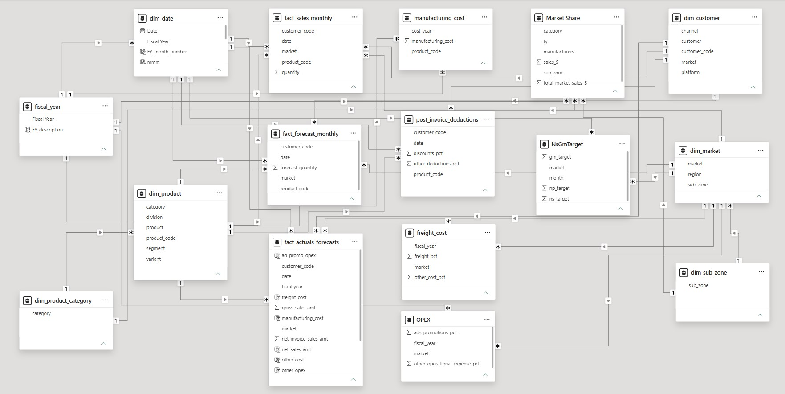
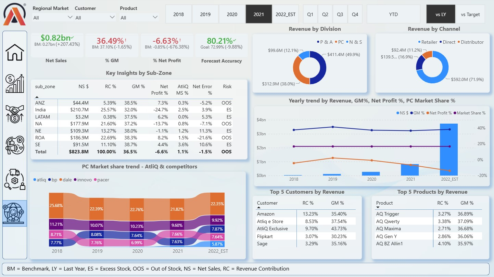

# 💻 Business Intelligence & Supply Chain Analytics

> An end-to-end Business Intelligence project transforming fragmented business data into an interactive analytical solution for executive decision-making across **Sales, Finance, and Supply Chain**.

---

## 📖 Project Overview & Business Background

### Business Context

AtliQ Hardware is a consumer electronics company operating across multiple countries and experiencing rapid business growth.

As the organization expanded, management continued to rely heavily on **Excel-based reporting** - a slow, hard-to-scale process with no centralized KPIs and limited visibility into market, customer, and profitability trends. A significant setback in the **Latin American market** further highlighted the need for stronger, data-driven decision-making.

### 🎯 Project Objective

The objective of this project was to build a centralized Power BI analytics solution that lets management **monitor sales and profitability, evaluate customers/products/markets, track gross margin, compare performance against targets, and analyze forecast accuracy and inventory risk (Excess Stock / Out of Stock)**, turning raw operational data into actionable recommendations.

---

## 🗂️ 2. Data Structure & Data Model

The Power BI solution uses a relational **semantic model** consisting of fact tables, dimension tables, and supporting analytical tables.

### Core Dimensions

| Dimension | Purpose |
|---|---|
| `dim_date` | Date, month, fiscal year, quarter, YTD and YTG analysis |
| `dim_customer` | Customer, platform, channel and market attributes |
| `dim_market` | Market, region and sub-zone hierarchy |
| `dim_product` | Product, division, segment, category and variant attributes |
| `dim_product_category` | Product category classification |
| `dim_sub_zone` | Regional sub-zone classification |
| `fiscal_year` | Fiscal-year reporting and filtering |

### Core Fact Tables

| Fact Table | Purpose |
|---|---|
| `fact_sales_monthly` | Monthly historical sales quantities |
| `fact_forecast_monthly` | Monthly forecast quantities |
| `fact_actuals_forecasts` | Sales, deductions, costs and operational metrics |
| `manufacturing_cost` | Product-level manufacturing cost information |
| `freight_cost` | Freight cost assumptions by market and fiscal year |
| `post_invoice_deductions` | Customer/product-level post-invoice deductions |
| `OPEX` | Operating expenses including advertising and promotions |

### Simplified Data Model

The model uses shared dimensions such as **Date, Customer, Product, and Market** to provide consistent filtering and analysis across sales, finance, and supply-chain metrics.

### 📅 Fiscal Calendar

AtliQ Hardware follows a **September–August fiscal year** rather than a January–December calendar year. The model therefore incorporates fiscal-year logic and YTD/YTG calculations to align reporting with the company's business calendar.

---

## 💡 Executive Summary

AtliQ Hardware is **scaling revenue faster than it is scaling profit**. FY2019 was the only year in the dataset with a positive net profit (**+$2.46M**), while **COGS consumes 59–63% of net sales** and nearly **half of gross sales is lost to deductions** before it ever reaches the bottom line. Growth is also concentrated: the **top 3 product segments drive ~79% of revenue**, and just **3 customers account for roughly a third of sales**, while **Desktop** emerged as a breakout category, surging from **$0.95M (FY2020) → $46.43M (FY2021)**. A sharp COVID-era demand shock (**$22.15M → $2.76M** in a single month) further exposed gaps in forecast accuracy and inventory planning.

---

## 📊 Key Insights

### 1. Growth isn't reaching the bottom line
FY2019 was the only year with a **positive net profit (+$2.46M)** - every subsequent year turned negative. **COGS eats 59–63% of net sales**, and deductions strip away roughly **half of gross sales** before it's realized as net sales. 
A high-revenue customer or product is not automatically a high-profit one.
 
### 2. Revenue is highly concentrated and exposed
- **3 customers** (Amazon, AtliQ Exclusive, AtliQ e Store) drive **~33% of revenue**
- **3 product segments** (Notebook, Accessories, Peripherals) drive **~79% of revenue**
- **APAC** leads on revenue, but **EU** is the more consistently profitable region
A disruption to any one of these - customer, segment, or region - would hit the business disproportionately.
 
### 3. Desktop is a breakout category, but needs a health check
Desktop revenue jumped from **$0.95M (FY2020) → $46.43M (FY2021)**. Before scaling further, the business should confirm this growth is backed by sustainable demand, healthy margin, and reliable supply and not just a spike.
 
### 4. Demand is seasonal
Sales typically peak **Sept–Dec** each fiscal year, but FY2020 also saw a severe one-month collapse (**$22.15M → $2.76M**, coinciding with COVID-19) before recovering within months. Forecasting and inventory planning need to account for both normal seasonality and low-probability shocks.
 
### 5. Forecast errors are driving real inventory risk
Forecast accuracy tracked at the product and customer level shows a direct link to **Excess Stock and Out-of-Stock** occurrences, including in the highest-revenue categories (Notebook, Accessories, Peripherals).
 
---
 
## 🎯 Recommendations
 
| Recommendation | Why It Matters |
|---|---|
| **Make profitability the primary KPI, not revenue** | Track Net Sales → Gross Margin → OPEX → Net Profit together; identify and reduce commercial deductions eating ~50% of gross sales. |
| **De-risk customer & product concentration** | Grow secondary accounts and segments so no single customer or category can disproportionately swing revenue. |
| **Stress-test Desktop before further investment** | Validate demand durability, margin, and supplier capacity behind the $46M+ growth before committing more inventory spend. |
| **Tighten demand & inventory planning** | Use seasonality and forecast-accuracy data to set product-level safety stock to cut ES/OOS risk. |

---

## 🛠 Tech Stack

- **Microsoft Power BI**: interactive dashboards, data visualization, semantic modeling, executive reporting, drill-down and cross-filtering
- **Power Query / M**: data extraction, cleaning, transformation, and preparation
- **Power BI Semantic Model**: fact/dimension architecture, relationships, fiscal calendar, target & benchmark modeling, supporting analytical tables
- **DAX & DAX Studio**: KPI development, P&L calculations, gross margin, net profit, YoY analysis, YTD/YTG calculations, forecast accuracy & error, benchmark comparisons, performance optimization
- **MySQL**: sales data, forecast data, customer & product dimensions, cost data, deduction data

---

## ⚠️ Caveats & Assumptions

- **2022_EST:** The model contains a `2022_EST` period with YTD/YTG logic; 2022 figures should not be automatically compared with completed historical fiscal years.
- **Insight assumption:** The dashboard identifies patterns and relationships (e.g., the March 2020 decline coinciding with COVID-19) but does not establish causality.
- **Inventory classifications rules:** `ES` and `OOS` are analytical classifications based on internal logic, not independently verified operational root causes.
